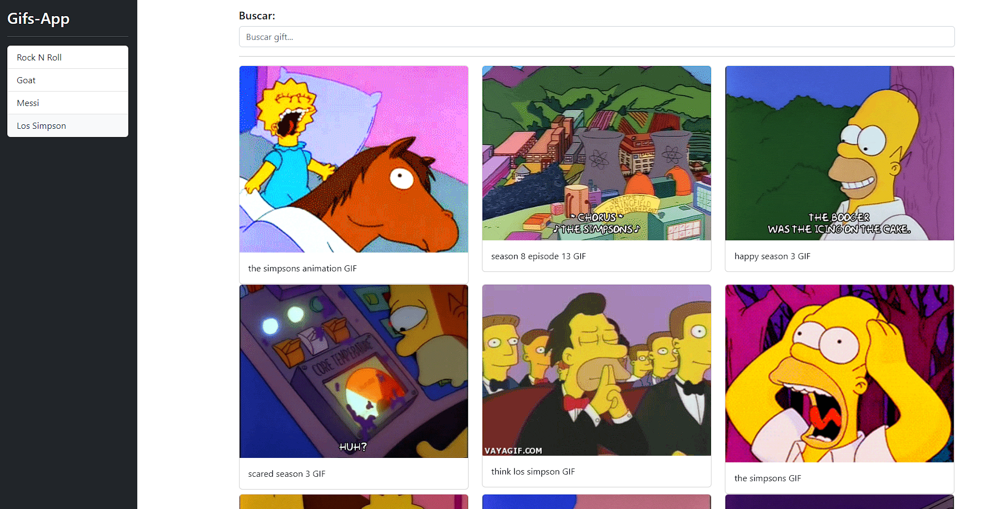

# Gifs App

## Descripción 👀

Proyecto de búsqueda de gifs por medio de la API [giphy](https://developers.giphy.com/), la aplicación permite buscar gifs relacionados a la busqueda que se le suministre en
en la barra de búsqueda, se guardará también un historial de las ultimas 10 búsquedas en localStorage.

La aplicación esta realizada con [Angular CLI](https://github.com/angular/angular-cli) versión 14.0.4. Y pertenece a la serie de proyectos del curso de
[Angular de cero a experto](https://www.udemy.com/course/angular-fernando-herrera/) de Udemy.
